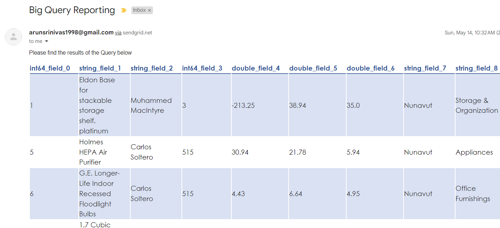
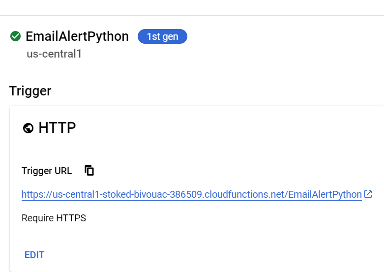
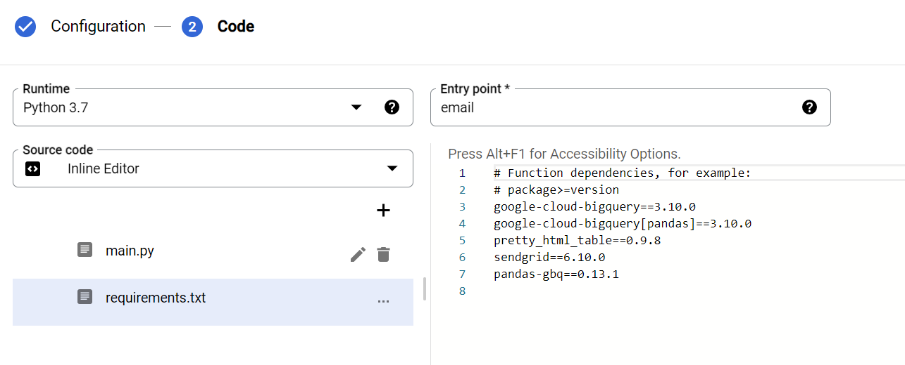
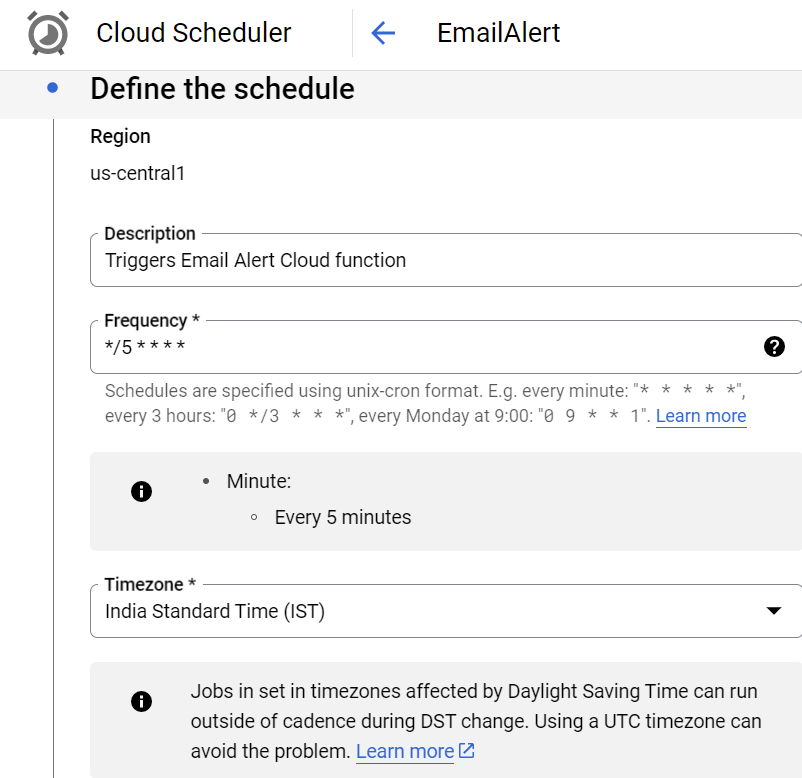
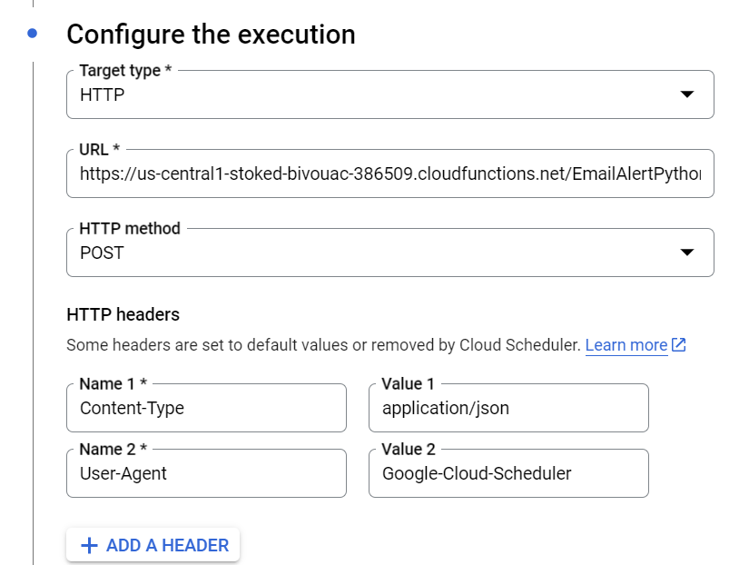
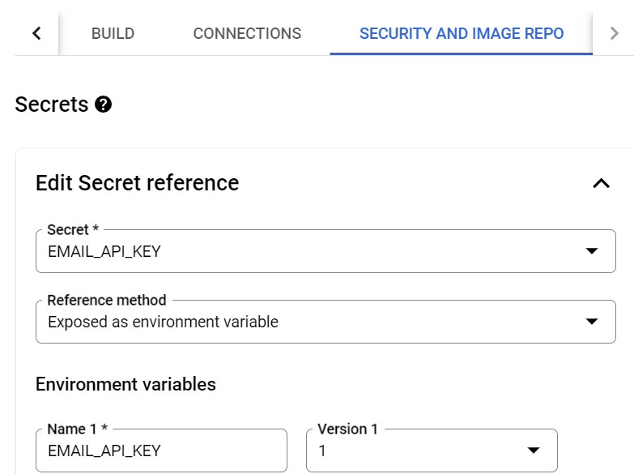
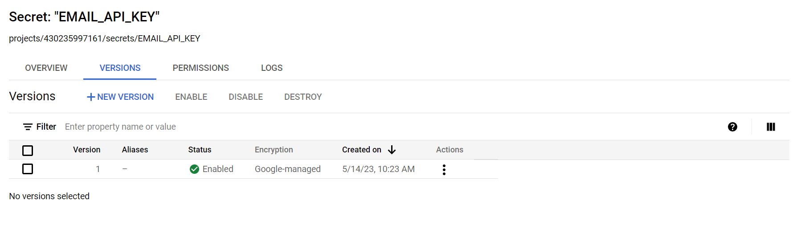

# 📊 BigQuery Reporting Automation

Automated email reporting pipeline using **Google BigQuery**, **Google Cloud Functions**, **Cloud Scheduler**, and **SendGrid** (or SMTP). Queries a BigQuery table on a schedule and delivers results as a formatted HTML table directly to your inbox.

---

## 📸 Sample Output

Below is a live email delivered by the pipeline — BigQuery query results formatted as a styled HTML table and sent via SendGrid:



---

## 🏗️ Architecture Overview

```
Cloud Scheduler (cron)
        │
        │  HTTP POST (every 5 min / custom schedule)
        ▼
Cloud Function — EmailAlertPython
        │
        ├──► BigQuery  ──► pandas DataFrame
        │         (SELECT * FROM TestData.TestTable)
        │
        ├──► pretty_html_table  ──► styled HTML table
        │
        └──► SendGrid API  ──► 📧 Email delivered
```

**GCP Services used:**

| Service | Role |
|---|---|
| BigQuery | Data source |
| Cloud Functions (1st gen) | Serverless compute — runs the Python function |
| Cloud Scheduler | Cron-based trigger |
| Secret Manager | Secure storage for the SendGrid API key |
| SendGrid (via API) | Email delivery |

---

## 📁 Repository Structure

```
bq-reporting-automation/
├── src/
│   ├── main.py              # Cloud Function — SendGrid version (primary)
│   ├── main_smtp.py         # Cloud Function — SMTP/Mailtrap alternative
│   └── requirements.txt     # Python dependencies for Cloud Function
│
├── config/
│   └── gcp_config.md        # GCP resource configuration reference
│
├── docs/
│   └── screenshots/         # Architecture & setup screenshots
│       ├── image1.png        # Cloud Function — HTTP trigger config
│       ├── image2.png        # Secret Manager — API key binding
│       ├── image3.png        # Encryption settings
│       ├── image4.png        # Cloud Function — code editor view
│       ├── image5.png        # Cloud Scheduler — define schedule
│       ├── image6.png        # Cloud Scheduler — configure execution
│       ├── image7.png        # Cloud Scheduler — auth & service account
│       ├── image8.png        # GCP Console — Secret Manager navigation
│       ├── image9.png        # Secret Manager — EMAIL_API_KEY versions
│       ├── image10.png       # (additional config screenshot)
│       ├── image11.png       # (additional config screenshot)
│       ├── image12.png       # (additional config screenshot)
│       ├── image13.png       # (additional config screenshot)
│       └── image14.png       # ✅ Sample output — delivered email
│
├── .github/
│   └── workflows/
│       └── lint.yml          # CI — flake8 + black lint check
│
├── .gitignore
└── README.md
```

---

## ⚙️ Prerequisites

- Google Cloud project with billing enabled
- BigQuery dataset and table
- [SendGrid account](https://sendgrid.com/) with a verified sender email
- `gcloud` CLI installed and authenticated

---

## 🚀 Setup & Deployment

### 1. Clone the repo

```bash
git clone https://github.com/<your-username>/bq-reporting-automation.git
cd bq-reporting-automation
```

### 2. Store the SendGrid API key in Secret Manager

```bash
# Create the secret
gcloud secrets create EMAIL_API_KEY --replication-policy="automatic"

# Add your API key
echo -n "SG.YOUR_SENDGRID_API_KEY" | \
  gcloud secrets versions add EMAIL_API_KEY --data-file=-
```

### 3. Deploy the Cloud Function

```bash
gcloud functions deploy EmailAlertPython \
  --runtime python37 \
  --trigger-http \
  --entry-point email \
  --region us-central1 \
  --source src/
```

> In the Cloud Console, bind the `EMAIL_API_KEY` secret under  
> **Function → Edit → Security and Image Repo → Secrets**.

### 4. Create the Cloud Scheduler job

```bash
gcloud scheduler jobs create http EmailAlert \
  --location us-central1 \
  --schedule "*/5 * * * *" \
  --uri "https://us-central1-<PROJECT_ID>.cloudfunctions.net/EmailAlertPython" \
  --http-method POST \
  --oidc-service-account-email <SERVICE_ACCOUNT_EMAIL> \
  --time-zone "Asia/Kolkata"
```

### 5. Test manually

```bash
curl -m 70 -X POST \
  https://us-central1-<PROJECT_ID>.cloudfunctions.net/EmailAlertPython \
  -H "Authorization: bearer $(gcloud auth print-identity-token)" \
  -H "Content-Type: application/json" \
  -d '{}'
```

---

## 🔧 Configuration

### Changing the query

Edit `src/main.py`:

```python
query = """SELECT * FROM `your_project.your_dataset.your_table`"""
```

### Changing the schedule

Modify the Cloud Scheduler cron expression. Examples:

| Cron | Meaning |
|---|---|
| `*/5 * * * *` | Every 5 minutes |
| `0 9 * * 1-5` | 9:00 AM, Mon–Fri |
| `0 8 * * *` | 8:00 AM daily |

### Changing the email theme

`pretty_html_table` supports multiple colour themes:

```python
output_table = build_table(df, "blue_light")  # or: "green_dark", "orange_light", "grey_light" …
```

---

## 📧 SMTP Alternative

If you prefer SMTP (e.g. Mailtrap for testing), use `src/main_smtp.py` as the Cloud Function source instead. Set the following environment variables on the function:

| Variable | Description |
|---|---|
| `SMTP_HOST` | SMTP host (e.g. `sandbox.smtp.mailtrap.io`) |
| `SMTP_PORT` | SMTP port (e.g. `2525`) |
| `SMTP_USERNAME` | SMTP username |
| `SMTP_PASSWORD` | SMTP password |
| `EMAIL_SENDER` | Sender address |
| `EMAIL_RECIPIENT` | Recipient address |

---

## 📦 Dependencies

```
google-cloud-bigquery==3.10.0
google-cloud-bigquery[pandas]==3.10.0
pretty_html_table==0.9.8
sendgrid==6.10.0
pandas-gbq==0.13.1
```

---

## 🖼️ Setup Screenshots

### Cloud Function — HTTP Trigger


### Cloud Function — Code & Runtime


### Cloud Scheduler — Schedule Definition


### Cloud Scheduler — Execution Config


### Secret Manager — API Key Binding


### Secret Manager — Key Versions


---

## 🛡️ Security Notes

- **Never commit API keys or credentials.** The SendGrid key is stored in GCP Secret Manager and injected at runtime as an environment variable.
- The `.gitignore` excludes all common secret file patterns.
- The Cloud Scheduler job uses OIDC authentication with a service account that has only the **Cloud Functions Invoker** role.

---

## 📋 Cloud Shell Setup Commands

If you need to set up a local or Cloud Shell environment for testing:

```bash
pip install --upgrade google-cloud-bigquery 'google-cloud-bigquery[bqstorage,pandas]'
pip install --upgrade pandas-gbq
pip install pretty-html-table
pip install sendgrid
```

---

## 🤝 Contributing

Pull requests are welcome. For major changes, please open an issue first to discuss what you would like to change.

---

## 📄 License

[MIT](LICENSE)
